# Implementation Plan - Apache Airflow DAG Orchestration

Orchestrate the entire end-to-end ML lifecycle using **Apache Airflow**, strictly following the class-based design pattern defined in **Section 8 of `GEMINI.md`**.

## User Review Required

> [!IMPORTANT]
> - Airflow tasks will invoke our existing pipeline classes directly (`SomePipeline(config).run()`), ensuring zero code duplication.
> - **Two Production DAGs** will be created:
>   1. `financial_risk_training_pipeline`: Full end-to-end ingestion, validation, feature engineering, training, evaluation, and champion registration.
>   2. `financial_risk_drift_monitoring`: Continuous drift monitoring with Evidently AI and conditional triggering of retraining.
> - If data validation fails, the DAG **immediately halts** before any downstream cleaning or training occurs.

## Proposed Architecture & DAG Structure

```mermaid
flowchart TD
    subgraph DAG 1: financial_risk_training_pipeline
        T1["1. Ingestion Task<br/>(CSV ➔ PostgreSQL)"] --> T2["2. Validation Task<br/>(Quality & PK Checks)"]
        T2 -->|Validation Passes| T3["3. Cleaning Task<br/>(cleaned.parquet)"]
        T2 -.->|Validation Fails| STOP["⛔ Halt DAG & Alert"]
        T3 --> T4["4. Feature Engineering Task<br/>(features.parquet)"]
        T4 --> T5["5. Dataset Builder Task<br/>(Stratified Group Split)"]
        T5 --> T6["6. Training Task<br/>(Model Training & MLflow Log)"]
        T6 --> T7["7. Evaluation Task<br/>(PR-AUC & Recall on Test Split)"]
        T7 --> T8["8. Registration Task<br/>(Champion vs Challenger Showdown)"]
    end

    subgraph DAG 2: financial_risk_drift_monitoring
        M1["1. Drift Detection Task<br/>(Evidently AI Report)"] --> M2{"2. Drift Threshold<br/>Exceeded?"}
        M2 -->|Yes| M3["Trigger Retraining Pipeline"]
        M2 -->|No| M4["Log Safe & Finish"]
    end
```



---

## Proposed Files to Create & Update

### 1. [NEW] `configs/airflow.yaml`
Centralized configuration for DAG execution rules, retries, and schedules:
- `training_dag_schedule`: `"@weekly"` (or `"0 0 * * 0"`)
- `monitoring_dag_schedule`: `"@daily"` (or `"0 2 * * *"`)
- `default_args`: `retries: 2`, `retry_delay_sec: 180`, `owner: "mlops"`

### 2. [NEW] `airflow/dags/financial_risk_training_dag.py`
The primary ML orchestration DAG:
- Uses `PythonOperator` for each stage.
- Wraps pipeline execution cleanly:
  ```python
  def run_stage(pipeline_cls, config_file=None):
      config = load_config(config_file) if config_file else {}
      result = pipeline_cls(config).run()
      if result.status != "success":
          raise AirflowException(f"Stage {pipeline_cls.__name__} failed: {result.error}")
      return result.metadata
  ```
- Tasks:
  1. `ingest_raw_data` (`IngestionPipeline`)
  2. `validate_raw_data` (`ValidationPipeline`)
  3. `clean_transactions` (`CleaningPipeline`)
  4. `engineer_features` (`FeatureEngineeringPipeline`)
  5. `build_datasets` (`DatasetBuilderPipeline`)
  6. `train_model` (`TrainingPipeline`)
  7. `evaluate_model` (`EvaluationPipeline`)
  8. `register_champion` (`RegistrationPipeline`)

### 3. [NEW] `airflow/dags/financial_risk_monitoring_dag.py`
Automated drift monitoring DAG:
- Runs `MonitoringPipeline`.
- Evaluates `result.metadata["retraining_triggered"]`.
- Conditionally triggers retraining if covariate drift exceeds threshold (`0.30`).

### 4. [NEW] `airflow/plugins/pipeline_operator.py` (Optional / Helper)
Shared operator helper for standardized logging and Airflow XCom reporting.

### 5. [NEW] `Doc/pipeline_docs/airflow_orchestration.md`
Comprehensive documentation explaining DAG layout, task execution, XCom telemetry, and operational maintenance.

---

## Verification Plan

### Automated Verification
1. **Airflow DAG Syntax & Parsing Test**:
   - Run python AST compilation on `airflow/dags/*.py` to ensure zero syntax or import errors.
2. **Task Execution Dry-Run**:
   - Verify each task function executes cleanly within test harness without raising unhandled exceptions.
3. **DAG Lineage & Dependency Integrity**:
   - Assert all upstream/downstream task relationships match the architectural design.
