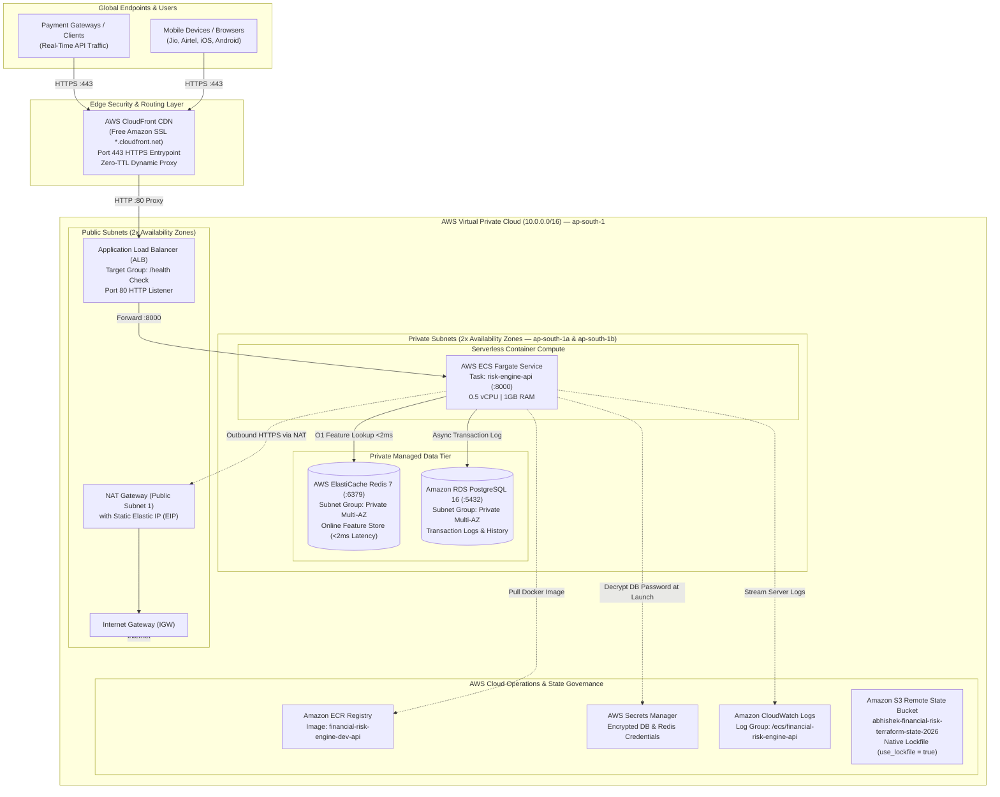

# Terraform Architecture & Modular Implementation Notes

This document provides a technical deep-dive into the Infrastructure-as-Code (IaC) architecture designed and deployed for the **Adaptive Financial Risk Intelligence Engine** on Amazon Web Services (AWS).

---

## 1. System Overview & Purpose

The production serving layer of the Financial Risk Intelligence Engine requires:
1. **Strict Latency SLA (<100ms):** Real-time evaluation of incoming financial transactions with scoring and classification.
2. **Sub-2ms Feature Lookups:** O(1) in-memory retrieval of customer behavioral profiles and velocity features via Redis.
3. **High Security & Compliance:** Zero public internet access to databases, encrypted credential storage, and network isolation.
4. **Reproducibility & Cost Efficiency:** Ability to spin up the entire 45-resource cloud environment in under 4 minutes and destroy it completely to avoid unnecessary cloud bills.

---

## 2. AWS Production Cloud Architecture



---

## 3. Directory Layout & Module Breakdown

The project follows a clean **child-module pattern** under `infrastructure/terraform/`:

```text
infrastructure/terraform/
├── bootstrap/                    # Isolated S3 State Bucket & Concurrency Setup
│   ├── main.tf                   # S3 Bucket with AES256 encryption & versioning
│   ├── variables.tf
│   └── outputs.tf
├── environments/
│   └── dev/                      # Root Dev Environment Orchestrator
│       ├── backend.tf            # S3 Backend + use_lockfile = true
│       ├── providers.tf          # AWS Provider (~> 6.0)
│       ├── variables.tf          # Configurable parameters with sensitive flags
│       ├── locals.tf             # Unified naming and tagging conventions
│       ├── main.tf               # Orchestrates all 8 child modules
│       ├── outputs.tf            # Exposes live URLs, DNS names, and endpoints
│       └── terraform.tfvars.example
└── modules/
    ├── networking/               # Multi-AZ VPC, 2x Public, 2x Private, IGW, NAT
    ├── security/                 # Security Groups with ingress + explicit egress rules
    ├── iam/                      # ECS Task Execution Role & ECS Task Role
    ├── database/                 # RDS PostgreSQL 16 + DB Subnet Group + Secrets Manager
    ├── cache/                    # ElastiCache Redis 7 + Subnet Group
    ├── load_balancer/            # ALB + Target Group (/health) + Port 80 Listener
    ├── compute/                  # ECR + CloudWatch + ECS Cluster + Fargate Task & Service
    └── cdn/                      # CloudFront HTTPS CDN distribution (free SSL proxy)
```

---

## 4. Detailed Module Responsibilities

### 4.1 `bootstrap/` (Remote State & Concurrency)
* **Goal:** Solves the chicken-and-egg problem of remote state storage.
* **Resources:** `aws_s3_bucket.terraform_state`, `aws_s3_bucket_versioning`, `aws_s3_bucket_server_side_encryption_configuration`, `aws_s3_bucket_public_access_block`.
* **Key Feature:** Enables S3 native conditional write locking (`use_lockfile = true`) for Terraform 1.10+.

### 4.2 `modules/networking/` (Multi-AZ Network Foundation)
* **Goal:** Provides the base VPC network with strict separation between public and private traffic.
* **Resources:**
  * `aws_vpc.main`: CIDR `10.0.0.0/16` with DNS hostnames and resolution enabled.
  * `aws_subnet.public` (2x): Distributed across `ap-south-1a` and `ap-south-1b`.
  * `aws_subnet.private` (2x): Distributed across `ap-south-1a` and `ap-south-1b`.
  * `aws_internet_gateway.main`: Ingress/egress for public subnets.
  * `aws_eip.nat` & `aws_nat_gateway.main`: Placed in Public Subnet 1, allowing private tasks to reach the internet without exposing them.
  * Route tables and associations for both public (IGW) and private (NAT) routes.

### 4.3 `modules/security/` (Security Groups & Rules)
* **Goal:** Implements least-privilege firewall rules for each tier.
* **Resources:**
  * `aws_security_group.alb`: Ingress on 80 (HTTP) and 443 (HTTPS) from `0.0.0.0/0`.
  * `aws_security_group.ecs`: Ingress on port 8000 only from the ALB security group. **Explicit Egress** to RDS (5432), Redis (6379), and HTTPS (443) via NAT.
  * `aws_security_group.redis`: Ingress on port 6379 only from the ECS security group.
  * `aws_security_group.rds`: Ingress on port 5432 only from the ECS security group.

### 4.4 `modules/iam/` (Identity & Access Management)
* **Goal:** Separation of infrastructure agent permissions from application runtime permissions.
* **Resources:**
  * `aws_iam_role.ecs_execution_role`: Used by the ECS Agent to pull Docker images from ECR, stream logs to CloudWatch, and decrypt secrets from Secrets Manager.
  * `aws_iam_role.ecs_task_role`: Used by Python application code inside the container for S3 model access and runtime calls.

### 4.5 `modules/database/` (PostgreSQL 16 Storage)
* **Goal:** Persistent transactional history, drift metrics, and Airflow metadata.
* **Resources:**
  * `aws_db_subnet_group.rds`: Spans both private subnets.
  * `aws_secretsmanager_secret.db_secret`: Stores database credentials encrypted in AWS Secrets Manager.
  * `aws_db_instance.postgres`: Engine `postgres 16`, instance class `db.t4g.micro`, 20GB gp3 storage, `skip_final_snapshot = true` (for dev teardowns).

### 4.6 `modules/cache/` (ElastiCache Redis 7 Feature Store)
* **Goal:** Low-latency online feature store for sub-2ms velocity lookups.
* **Resources:**
  * `aws_elasticache_subnet_group.redis`: Spans both private subnets.
  * `aws_elasticache_cluster.redis`: Engine `redis 7.0`, node type `cache.t4g.micro`, port 6379.

### 4.7 `modules/load_balancer/` (Application Load Balancer)
* **Goal:** High-availability reverse proxy receiving user traffic and routing to ECS tasks.
* **Resources:**
  * `aws_lb.main`: External Application Load Balancer across public subnets.
  * `aws_lb_target_group.api`: Target type `ip` (required for Fargate), port 8000, with active health checks hitting `/health` (interval 30s, timeout 5s, 200 OK matcher).
  * `aws_lb_listener.http`: Port 80 forwarder to the API target group.

### 4.8 `modules/compute/` (Container Compute Tier)
* **Goal:** Serverless Docker execution without managing EC2 virtual machines.
* **Resources:**
  * `aws_ecr_repository.api`: Private Docker registry (`financial-risk-engine-dev-api`) with scan-on-push enabled.
  * `aws_cloudwatch_log_group.ecs_api`: Dedicated log stream (`/ecs/financial-risk-engine-dev-api`) with 7-day retention.
  * `aws_ecs_cluster.main`: Container cluster managing tasks.
  * `aws_ecs_task_definition.api`: Fargate task configuration allocating 512 CPU units (0.5 vCPU) and 1024 MiB RAM, injecting `DATABASE_URL` and `REDIS_URL`.
  * `aws_ecs_service.api`: Maintains 1 healthy desired task replica attached to the ALB target group.

### 4.9 `modules/cdn/` (CloudFront HTTPS Front-Door)
* **Goal:** Provides a free, globally trusted SSL/HTTPS endpoint with an Amazon certificate.
* **Resources:**
  * `aws_cloudfront_distribution.api_cdn`: Origin pointing to the ALB with `http-only` protocol policy.
  * Dynamic proxy configuration: `viewer_protocol_policy = "redirect-to-https"`, `allowed_methods = ALL`, and `TTL = 0` to ensure all API responses are live and un-cached.
  * `viewer_certificate`: Uses the free `*.cloudfront.net` wildcard SSL certificate.
