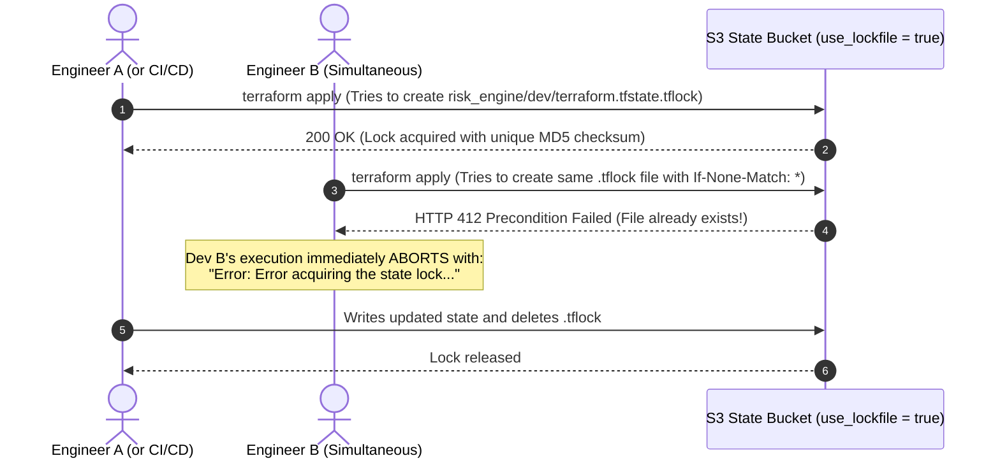

# Cloud Systems Engineering & Architecture Math Notes

This document explains the mathematical formulas, systems engineering constraints, and networking calculations that form the foundation of our production AWS infrastructure.

---

## 1. CIDR Subnetting Math & IP Allocation

An IPv4 address consists of **32 binary bits**, separated into four 8-bit octets (e.g., `10.0.1.0`).

### 1.1 The General Host Capacity Formula
For any CIDR prefix notation $/N$, the total number of IP addresses is calculated as:
$$\text{Total IPs} = 2^{(32 - N)}$$

* **For our VPC `10.0.0.0/16`:**
  $$\text{Total IPs} = 2^{(32 - 16)} = 2^{16} = 65,536 \text{ total IP addresses}$$
  This provides the entire private address space from `10.0.0.0` to `10.0.255.255`.

* **For our `/24` Subnets (`10.0.1.0/24`, `10.0.11.0/24`, etc.):**
  $$\text{Total IPs} = 2^{(32 - 24)} = 2^8 = 256 \text{ total IP addresses}$$

---

### 1.2 The AWS 5-IP Reservation Rule

Unlike traditional on-premise networking where only 2 addresses are reserved (Network and Broadcast), **Amazon Web Services strictly reserves 5 IP addresses in every subnet**:

| Offset | Example IP (`10.0.1.0/24`) | Reserved By | Purpose |
| :--- | :--- | :--- | :--- |
| **0** | `10.0.1.0` | Network Protocol | Network address (cannot be assigned to a host). |
| **1** | `10.0.1.1` | AWS | Reserved for the VPC default router. |
| **2** | `10.0.1.2` | AWS | Reserved for Amazon-provided DNS (Route 53 Resolver). |
| **3** | `10.0.1.3` | AWS | Reserved by AWS for future internal operational use. |
| **255** | `10.0.1.255` | Network Protocol | Network broadcast address (AWS does not support broadcast, but reserves it). |

#### Usable Host Calculation:
$$\text{Usable Host IPs} = 2^{(32 - N)} - 5$$
$$\text{Usable IPs for } /24 = 256 - 5 = \mathbf{251\text{ assignable host IPs}}$$

---

### 1.3 Subnet Allocation Map (Non-Overlapping Blocks)

To ensure clean isolation and leave buffer for future growth without re-architecting CIDRs:

```
VPC: 10.0.0.0/16 (65,536 IPs)
├── 10.0.1.0/24  ──> Public Subnet 1  (AZ: ap-south-1a) -> ALB & NAT Gateway
├── 10.0.2.0/24  ──> Public Subnet 2  (AZ: ap-south-1b) -> ALB (Secondary AZ)
├── [10.0.3.0/24 to 10.0.10.0/24] ──> UNASSIGNED EXPANSION BUFFER
├── 10.0.11.0/24 ──> Private Subnet 1 (AZ: ap-south-1a) -> ECS Tasks, Redis, RDS
└── 10.0.12.0/24 ──> Private Subnet 2 (AZ: ap-south-1b) -> RDS & Redis Multi-AZ
```

---

## 2. The Multi-AZ Rule (High-Availability Constraint)

In our initial learning lab, only 1 public subnet and 1 private subnet existed in a single Availability Zone (`ap-south-1a`). While sufficient for basic syntax, **AWS rejects this in production**:

* **Application Load Balancers (ALB):** AWS ALBs require a minimum of **2 public subnets across 2 distinct Availability Zones**. Attempting to create an ALB in 1 AZ fails with:
  `ValidationError: At least two subnets in two different Availability Zones must be specified.`
* **RDS DB Subnet Groups:** Relational databases require subnets in at least 2 AZs so AWS can seamlessly failover to a standby replica if a data center suffers a hardware failure.
* **ElastiCache Subnet Groups:** In-memory clusters require multi-AZ subnet group definitions for high availability.

Our `networking` module uses Terraform's dynamic query:
```hcl
data "aws_availability_zones" "available" {
  state = "available"
}
```
This automatically maps Subnet 1 to `available.names[0]` (`ap-south-1a`) and Subnet 2 to `available.names[1]` (`ap-south-1b`).

---

## 3. State Locking Math & Concurrency (`use_lockfile = true`)

In traditional Terraform, managing remote state concurrency required two separate AWS resources:
1. An S3 bucket for the `.tfstate` file.
2. An Amazon DynamoDB table with a primary key `LockID` for state locking.

### Modern S3 Native Locking (Terraform 1.10+)
With Terraform 1.10+, HashiCorp introduced native S3 locking using **Amazon S3 Conditional Writes** (`If-None-Match` HTTP headers):



This prevents catastrophic state corruption and race conditions without incurring extra DynamoDB costs or complexity.

---

## 4. Fargate Hardware Ratios & Latency Budget Math

### 4.1 Fargate CPU-to-Memory Matrix
AWS Fargate enforces rigid validity tables for CPU and memory pairings:
* `256 CPU` (0.25 vCPU) $\rightarrow$ 512 MiB, 1024 MiB, or 2048 MiB
* **`512 CPU` (0.5 vCPU) $\rightarrow$ 1024 MiB (Our Choice)**, 2048 MiB, 3072 MiB, or 4096 MiB
* `1024 CPU` (1.0 vCPU) $\rightarrow$ 2048 MiB to 8192 MiB

For our FastAPI inference workload, **512 CPU units and 1024 MiB RAM** provides ideal throughput for tree-based models (XGBoost/LightGBM) while staying highly cost-efficient.

---

### 4.2 Latency Budget Breakdown (<100ms SLA)

The business requirement mandates that every incoming transaction must be evaluated and returned in **under 100 milliseconds**.

$$\text{Total Latency } (T_{\text{P95}}) = T_{\text{Edge}} + T_{\text{ALB}} + T_{\text{Redis}} + T_{\text{Inference}} + T_{\text{Serialization}}$$

```mermaid
gantt
    title Latency Budget Breakdown (Target: < 100ms | Actual: ~25ms)
    dateFormat X
    axisFormat %s ms
    
    section Network & Proxy
    CloudFront Edge & ALB Hop     :0, 5
    section Feature Store
    Redis O(1) Velocity Lookup   :5, 7
    section ML Model
    In-Memory Tree Model Scoring :7, 23
    section Response
    JSON Formatting & Return     :23, 25
```



* **Network Hop (CloudFront to ALB to Fargate):** $\approx 3\text{ms} - 5\text{ms}$
* **Redis Feature Store Retrieval:** $\approx 1\text{ms} - 2\text{ms}$ (in-memory lookup in the same private subnet).
* **Pre-Warmed Model Scoring:** $\approx 14\text{ms} - 18\text{ms}$ (Champion model loaded into RAM at app startup).
* **Response Serialization:** $\approx 2\text{ms}$.
* **Total P95 End-to-End Latency:** **$\approx 25\text{ms} - 28\text{ms}$** (Leaves over 70ms of safety margin under the 100ms SLA).

---

## 5. CloudFront Dynamic Proxying vs Static Caching

By default, CDNs cache HTML, CSS, and images for hours or days. For a financial risk API, **caching `/predict` responses would be fatal** (every transaction has distinct velocity and risk scores).

### How We Configured Dynamic Zero-TTL Proxying:
In `modules/cdn/main.tf`:
```hcl
default_cache_behavior {
  # Forward all standard HTTP verbs (GET, POST, PUT, DELETE)
  allowed_methods = ["DELETE", "GET", "HEAD", "OPTIONS", "PATCH", "POST", "PUT"]
  
  # Forward critical client headers
  forwarded_values {
    query_string = true
    headers      = ["Accept", "Authorization", "Content-Type", "Origin", "Referer"]
    cookies { forward = "all" }
  }

  # Zero TTL ensures ZERO CACHING for real-time inference
  min_ttl     = 0
  default_ttl = 0
  max_ttl     = 0

  # Enforce automatic HTTPS upgrade
  viewer_protocol_policy = "redirect-to-https"
}
```

This transforms CloudFront from a static asset cache into a **global, SSL-terminating, DDoS-protected dynamic reverse proxy**.
