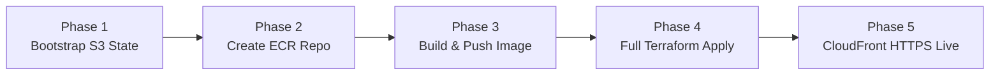

# Deployment & Operations Runbook (AWS & Terraform)

This document provides the standard operating procedures, step-by-step commands, verification checks, cost-management teardown flows, and troubleshooting guides for the **Adaptive Financial Risk Intelligence Engine** infrastructure.

---

## 1. Prerequisites Checklist

Before executing any deployment commands, verify the following:
* [x] **Terraform CLI**: Version `>= 1.10.0` (required for native `use_lockfile = true`).
* [x] **AWS CLI**: Installed and configured with profile `terraform-lab` in region `ap-south-1`.
* [x] **Docker Engine**: Docker Desktop running locally.
* [x] **Conda Environment**: `financial_risk_intelligence` activated.

```powershell
# Verify CLI tools
terraform -version
aws sts get-caller-identity --profile terraform-lab --region ap-south-1
docker --version
```

---

## 2. Step-by-Step Deployment Runbook

Follow this exact 5-phase sequence to deploy the entire cloud infrastructure from scratch:



---

### Phase 1: Bootstrap Remote State (Run Once per Account)
Creates the S3 bucket that holds remote state with encryption and versioning.

```powershell
# 1. Initialize and apply the bootstrap module
terraform -chdir=infrastructure/terraform/bootstrap init
terraform -chdir=infrastructure/terraform/bootstrap apply -auto-approve
```
*Output: `state_bucket_name = "abhishek-financial-risk-terraform-state-2026"`.*

---

### Phase 2: Create the Private ECR Repository
Before ECS Fargate can launch, the private container registry must exist so we have a target URL to push our Docker image to.

```powershell
# 1. Initialize the dev environment
terraform -chdir=infrastructure/terraform/environments/dev init -reconfigure

# 2. Targeted apply for only the ECR repository
terraform -chdir=infrastructure/terraform/environments/dev apply -target=module.compute.aws_ecr_repository.api -auto-approve
```
*Output: `ecr_repository_url = "205096517604.dkr.ecr.ap-south-1.amazonaws.com/financial-risk-engine-dev-api"`.*

---

### Phase 3: Build & Push the Docker Image to ECR
Package the production FastAPI serving code from `docker/Dockerfile.api` and upload it to AWS.

```powershell
# 1. Authenticate Docker with AWS ECR
aws ecr get-login-password --region ap-south-1 --profile terraform-lab | docker login --username AWS --password-stdin 205096517604.dkr.ecr.ap-south-1.amazonaws.com

# 2. Build the Docker image locally
docker build -t financial-risk-engine-dev-api:latest -f docker/Dockerfile.api .

# 3. Tag the image for ECR
docker tag financial-risk-engine-dev-api:latest 205096517604.dkr.ecr.ap-south-1.amazonaws.com/financial-risk-engine-dev-api:latest

# 4. Push image to Amazon ECR
docker push 205096517604.dkr.ecr.ap-south-1.amazonaws.com/financial-risk-engine-dev-api:latest
```

---

### Phase 4: Full Infrastructure Apply
Provision the Multi-AZ VPC, subnets, NAT Gateway, security groups, RDS PostgreSQL, ElastiCache Redis, ALB, ECS Fargate service, and CloudFront CDN.

```powershell
# Preview changes
terraform -chdir=infrastructure/terraform/environments/dev plan

# Apply all 45 resources
terraform -chdir=infrastructure/terraform/environments/dev apply -auto-approve
```

---

## 3. Live Endpoints & Verification

Once `terraform apply` finishes, the live endpoints are printed in the Terraform outputs:

| Service Endpoint | Description | Protocol / Port |
| :--- | :--- | :--- |
| **`https_api_url`** | `https://d3iakj6acvi3bc.cloudfront.net` | Global HTTPS (Port 443) |
| **`https_api_docs_url`** | `https://d3iakj6acvi3bc.cloudfront.net/docs` | Interactive Swagger API Docs |
| **`https_api_health_url`** | `https://d3iakj6acvi3bc.cloudfront.net/health` | Health Check Probe |
| **`alb_dns_name`** | `financial-risk-engine-dev-alb-*.elb.amazonaws.com` | Direct Origin Load Balancer |
| **`db_endpoint`** | `financial-risk-engine-dev-postgres.*:5432` | Private RDS PostgreSQL |
| **`redis_endpoint`** | `financial-risk-engine-dev-redis.*:6379` | Private ElastiCache Redis |

---

### Verification Commands

#### 1. Test Health Check Endpoint:
```powershell
curl -i https://d3iakj6acvi3bc.cloudfront.net/health
```
*Expected Output: `HTTP/2 200` with `{"status": "healthy"}`.*

#### 2. Inspect Running ECS Tasks:
```powershell
aws ecs list-tasks --cluster financial-risk-engine-dev-cluster --profile terraform-lab --region ap-south-1
```

#### 3. View Live Server Logs in CloudWatch:
```powershell
aws logs tail /ecs/financial-risk-engine-dev-api --follow --profile terraform-lab --region ap-south-1
```

---

## 4. Cost Management & Clean Teardown

In AWS, running managed services continuously incurs charges:
* **NAT Gateway:** $\approx \$32/\text{month}$ ($\approx \$1.05/\text{day}$).
* **Application Load Balancer:** $\approx \$18/\text{month}$ ($\approx \$0.60/\text{day}$).
* **RDS PostgreSQL (`db.t4g.micro`):** $\approx \$15/\text{month}$.
* **ElastiCache Redis (`cache.t4g.micro`):** $\approx \$13/\text{month}$.
* **ECS Fargate:** Pay-per-second based on vCPU and RAM used.

### Teardown Runbook (Avoid Unwanted Bills):
When you finish testing or demonstrating the project, tear down the temporary infrastructure:

```powershell
terraform -chdir=infrastructure/terraform/environments/dev destroy -auto-approve
```

> [!NOTE]
> * `terraform destroy` safely cleans up all 45 resources (NAT, ALB, ECS, Redis, RDS, CloudFront).
> * Your **Docker image in ECR** and your **S3 state bucket** remain permanently preserved so you can re-deploy the entire environment with a single `apply` command in 3 minutes whenever needed.

---

## 5. Troubleshooting Common Issues

### Issue 1: `Backend initialization required, please run "terraform init"`
* **Cause:** The backend was previously initialized with `-backend=false` or backend settings were modified.
* **Resolution:**
  ```powershell
  terraform -chdir=infrastructure/terraform/environments/dev init -reconfigure
  ```

### Issue 2: ECS Service Fails with `CannotPullContainerError`
* **Cause:** Terraform attempted to start the Fargate task before the Docker image was pushed to Amazon ECR.
* **Resolution:** Follow Phase 3 to build and push the image to ECR, then rerun `terraform apply`.

### Issue 3: Phone Browser Shows "Site Can't Be Reached" on HTTP ALB Link
* **Cause:** Mobile browsers (Chrome, Safari) automatically force `https://` on public domains. Because the raw ALB listens on HTTP port 80 without SSL, mobile browsers block the connection.
* **Resolution:** Use the **CloudFront HTTPS link** (`https://d3iakj6acvi3bc.cloudfront.net`) which has a free, globally recognized Amazon SSL certificate.
