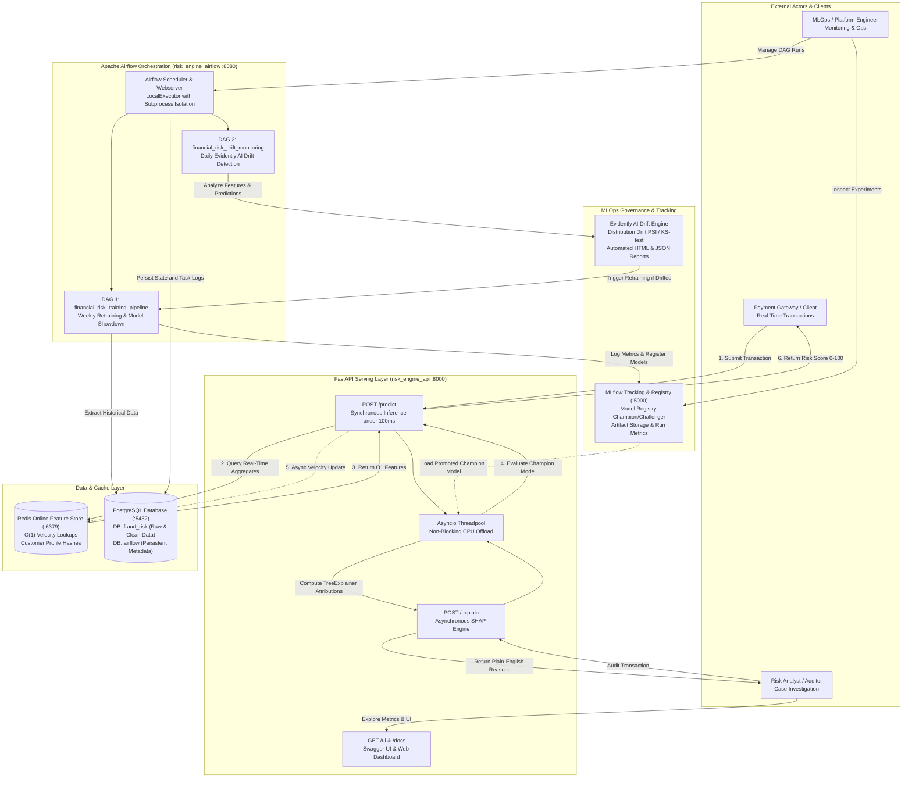
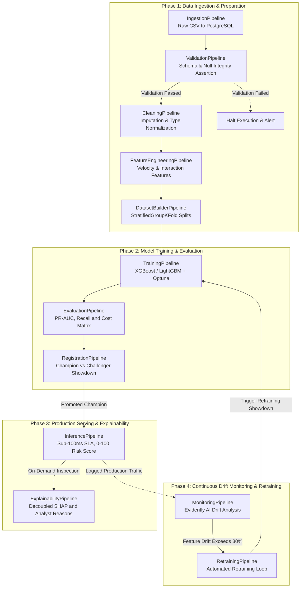

# Adaptive Financial Risk Intelligence Engine

[](https://www.python.org/)
[](https://fastapi.tiangolo.com/)
[](https://mlflow.org/)
[](https://airflow.apache.org/)
[](https://redis.io/)
[](https://www.docker.com/)
[](https://www.terraform.io/)

---

## Executive Summary

The **Adaptive Financial Risk Intelligence Engine** is an enterprise-grade Machine Learning Operations (MLOps) system built for continuous financial transaction evaluation, risk scoring, and real-time fraud mitigation. 

Unlike conventional data science projects or exploratory notebooks, this system implements a production-grade engineering architecture with a strict **sub-100ms prediction latency SLA**, decoupled explainability, automated champion/challenger model lifecycles, and drift-aware retraining workflows.

### The Problem Formulation
* **Target Domain**: Credit card transaction evaluation on the IEEE-CIS Fraud Detection dataset (~590,000 transactions, 434 raw features).
* **Extreme Class Imbalance**: Genuine transactions heavily outnumber fraudulent events (~3.5% positive prevalence), necessitating cost-sensitive learning (`scale_pos_weight`) and evaluation prioritized around Precision-Recall AUC (PR-AUC) and Recall rather than deceptive accuracy metrics.
* **Production Constraint**: Synchronous fraud prevention requires instant scoring (<100ms), while forensic auditing requires detailed SHAP feature attributions that are computationally prohibitive to run on the hot path.

---

## End-to-End System Architecture & Data Flow

The following diagram illustrates the complete architectural interaction across external actors, the FastAPI serving layer, data stores, the MLOps governance platform, and Apache Airflow orchestration:



---

## Key MLOps Architectural Highlights

### 1. Champion/Challenger Model Registry (MLflow)
The system enforces a strict automated promotion gate. Candidate models (XGBoost, LightGBM) are trained using Bayesian hyperparameter optimization (Optuna) and registered as challengers. An automated evaluation gate compares the challenger against the current production champion on holdout test data; only models that demonstrate superior PR-AUC and recall are promoted to production status.

### 2. Ultra-Low Latency Serving (<100ms SLA)
The real-time inference layer is built using FastAPI with an asynchronous threadpool to keep the event loop non-blocking. Live inference bypasses slow relational database queries by reading customer velocity counters and transaction aggregations directly from an in-memory Redis Online Feature Store in O(1) time.

### 3. Decoupled Business Explainability (SHAP)
Prediction and explanation are architecturally decoupled to preserve the sub-100ms prediction SLA:
* **The `/predict` Endpoint**: Evaluates transactions instantly and returns the risk score, risk level, and calibrated probability.
* **The `/explain` Endpoint**: Runs asynchronously on a separate threadpool when requested by an analyst, computing SHAP `TreeExplainer` values and translating raw numeric attributions into domain-interpretable narratives (e.g., *"Transaction amount is 4.2x customer 90-day average"*).

### 4. Continuous Drift Monitoring & Automated Retraining (Evidently AI)
Data distribution shifts and concept drift are continuously tracked using Evidently AI. When feature drift or target drift exceeds configured statistical thresholds, the monitoring service triggers an event-driven retraining loop to evaluate new candidate models against production standards.

### 5. Multi-Container Microservices Architecture
The entire application stack is containerized across five coordinated microservices:
1. `risk_engine_postgres`: Relational transactional storage and persistent Apache Airflow metadata backend.
2. `risk_engine_redis`: Low-latency Online Feature Store and behavioral cache.
3. `risk_engine_mlflow`: Centralized experiment tracking server and Model Registry.
4. `risk_engine_api`: High-throughput FastAPI inference and explainability engine.
5. `risk_engine_airflow`: Workflow orchestrator running scheduled training and drift monitoring DAGs.

---

## Class-Based Pipeline Architecture

Following the architectural requirements defined in `GEMINI.md`, every pipeline stage inherits from an abstract `BasePipeline` class (`pipelines/base_pipeline.py`). This guarantees uniform structured logging, timing telemetry, error propagation, and configuration loading across all tasks.



### Core Pipeline Classes

| Pipeline File | Class Name | Output Artifact | Key Responsibility |
| :--- | :--- | :--- | :--- |
| `ingestion_pipeline.py` | `IngestionPipeline` | PostgreSQL raw tables | Ingests transactional and identity data into PostgreSQL. |
| `validation_pipeline.py` | `ValidationPipeline` | Validation report | Asserts schema integrity, data types, and primary key uniqueness. |
| `cleaning_pipeline.py` | `CleaningPipeline` | `cleaned.parquet` | Handles structural missingness, type downcasting, and sanitization. |
| `feature_engineering_pipeline.py` | `FeatureEngineeringPipeline` | `features.parquet` | Computes velocity metrics, interaction features, and aggregates. |
| `dataset_builder_pipeline.py` | `DatasetBuilderPipeline` | `train/val/test.parquet` | Implements leak-free `StratifiedGroupKFold` partitioning. |
| `training_pipeline.py` | `TrainingPipeline` | `model.pkl` | Trains gradient boosted trees and logs parameters/metrics to MLflow. |
| `evaluation_pipeline.py` | `EvaluationPipeline` | `evaluation.json` | Computes PR-AUC, ROC-AUC, F1, and cost-sensitive confusion matrices. |
| `registration_pipeline.py` | `RegistrationPipeline` | MLflow Production Model | Compares challenger vs. champion PR-AUC and promotes the winner. |
| `inference_pipeline.py` | `InferencePipeline` | Prediction dictionary | Combines raw payload with Redis cache to generate risk scores (0–100). |
| `explainability_pipeline.py` | `ExplainabilityPipeline` | SHAP explanations | Generates global and local feature attributions via `TreeExplainer`. |
| `monitoring_pipeline.py` | `MonitoringPipeline` | Drift reports (HTML/JSON) | Computes population stability index (PSI) and data drift via Evidently AI. |
| `retraining_pipeline.py` | `RetrainingPipeline` | Retrained model candidate | Executes end-to-end retraining when triggered by drift thresholds. |

---

## Technology Stack

| Layer | Technology | Purpose |
| :--- | :--- | :--- |
| **Modeling** | XGBoost, LightGBM, Scikit-learn | Gradient boosted decision trees for imbalanced tabular classification |
| **Hyperparameter Tuning** | Optuna | Bayesian hyperparameter optimization across cross-validation folds |
| **Explainability** | SHAP | Decoupled local feature contributions and human-readable narratives |
| **Experiment Tracking** | MLflow | Metric logging, parameter tracking, and Champion/Challenger Model Registry |
| **Workflow Orchestrator** | Apache Airflow 2.9 | Scheduled DAG execution (`LocalExecutor`, PostgreSQL metadata backend) |
| **Serving Layer** | FastAPI, Uvicorn | Asynchronous REST API serving `/predict`, `/predict/batch`, and `/explain` |
| **Online Feature Store** | Redis 7 | Sub-millisecond profile caching and transactional velocity tracking |
| **Relational Storage** | PostgreSQL 16 | Transaction history and Airflow operational state store |
| **Data Drift Monitoring** | Evidently AI | Distribution drift detection, KS-tests, and data quality reporting |
| **Containerization** | Docker, Docker Compose | Multi-container local/production parity with health check orchestration |
| **Infrastructure as Code** | Terraform | Cloud provisioning for AWS (ECS Fargate, RDS, ElastiCache, VPC) |

---

## Repository Structure

```text
Adaptive-Financial-Risk-Intelligence-Engine/
├── airflow/                    # Apache Airflow DAGs and orchestration configuration
│   └── dags/
│       ├── financial_risk_training_dag.py     # End-to-end training & registration DAG
│       └── financial_risk_monitoring_dag.py   # Continuous drift monitoring & retraining DAG
├── api/                        # Production FastAPI application
│   ├── routes/                 # Endpoint modules: /predict, /explain, /health, /ui
│   ├── schemas.py              # Pydantic request/response validation contracts
│   └── app.py                  # Application factory with lifespan and dependency injection
├── configs/                    # Centralized YAML configuration files
│   ├── airflow.yaml            # DAG schedules, retry policies, and task arguments
│   ├── database.yaml           # PostgreSQL connection pools and table names
│   ├── model.yaml              # Hyperparameters, feature triage lists, and thresholds
│   └── monitoring.yaml         # Drift detection thresholds and Evidently test suites
├── database/                   # Database interfaces, connection pools, and loaders
├── docker/                     # Service-specific Dockerfiles (API, Airflow, MLflow)
├── docs/                       # Architectural blueprints, Docker runbooks, and pipeline docs
├── explainability/             # SHAP calculation engines and reason mapping utilities
├── feature_store/              # Redis feature store clients and customer profile builders
├── ml/                         # Core machine learning logic (training, evaluation, tuning)
├── pipelines/                  # Class-based pipeline stages (BasePipeline implementations)
├── scripts/                    # Command-line entry points for training, tuning, and testing
├── shared/                     # Cross-cutting utilities: structured logging, exceptions, config loaders
├── tests/                      # Unit, integration, and API test suites
└── docker-compose.yml          # Multi-service container orchestration manifest
```

---

## Getting Started (Local Development)

### 1. Environment Setup
Clone the repository and activate the dedicated Conda environment:

```bash
git clone https://github.com/abhi24112/Financial_Risk_Intelligence_Engine_MLOps.git
cd Financial_Risk_Intelligence_Engine_MLOps

# Activate conda environment
conda activate financial_risk_intelligence
```

### 2. Start the Multi-Container Infrastructure
Launch all five microservices in detached mode:

```bash
docker compose up -d
```

Verify that all containers reach a healthy state:

```bash
docker compose ps
```

### 3. Service Endpoints and Dashboards
Once running, the following interfaces are available:

* **FastAPI Swagger Documentation**: [http://localhost:8000/docs](http://localhost:8000/docs)
* **FastAPI Interactive UI**: [http://localhost:8000/ui](http://localhost:8000/ui)
* **MLflow Tracking Server & Model Registry**: [http://localhost:5000](http://localhost:5000)
* **Apache Airflow Webserver**: [http://localhost:8080](http://localhost:8080)
  * **Username**: `admin`
  * **Password**: `admin`

### 4. Running Pipelines via CLI
Core ML workflows can be executed directly using the standalone CLI scripts:

```bash
# Set PYTHONPATH for module resolution
$env:PYTHONPATH = "."          # Windows PowerShell
# export PYTHONPATH="."        # Linux / macOS

# 1. Run Bayesian hyperparameter tuning with Optuna
python scripts/tune.py --model lightgbm

# 2. Train the model and log artifacts to MLflow
python scripts/train.py --config model.yaml

# 3. Evaluate and promote candidate model via Champion/Challenger showdown
python scripts/register.py --config model.yaml
```

### 5. Triggering DAGs via Apache Airflow CLI
Pipelines can also be orchestrated within the containerized Airflow environment:

```bash
# Trigger the complete training, evaluation, and registration pipeline
docker compose exec airflow airflow dags trigger financial_risk_training_pipeline

# Trigger the continuous drift monitoring pipeline
docker compose exec airflow airflow dags trigger financial_risk_drift_monitoring

# List all registered DAGs
docker compose exec airflow airflow dags list
```

### 6. Executing Test Suites
Run the automated test suite across unit and integration tests:

```bash
pytest tests/unit tests/integration -v
```

---
