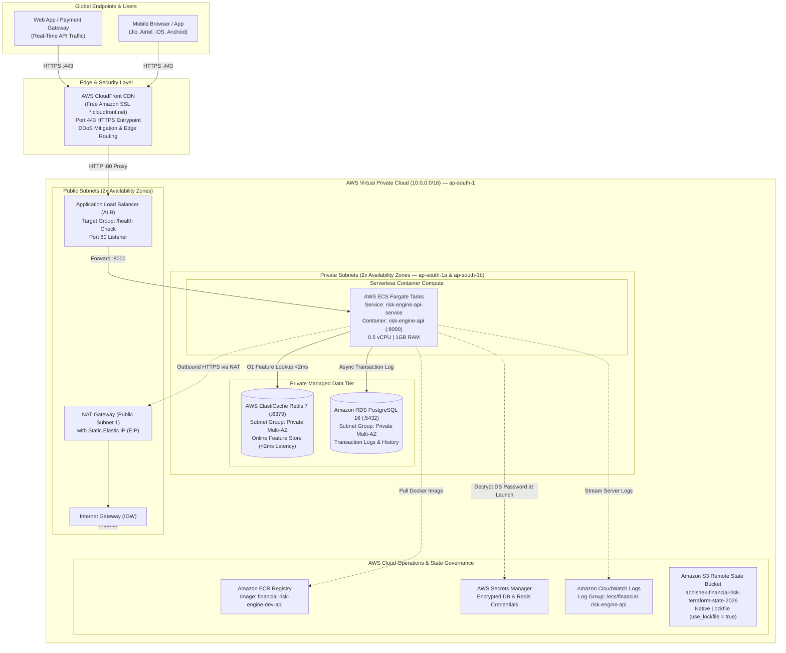
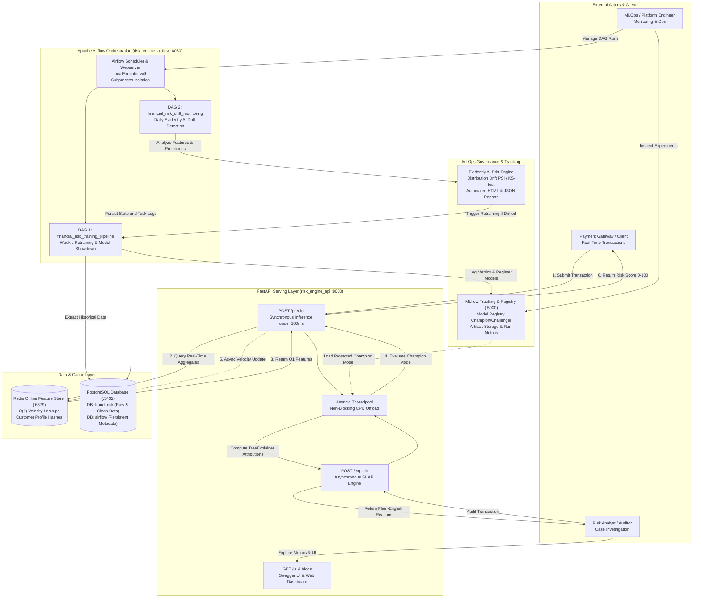
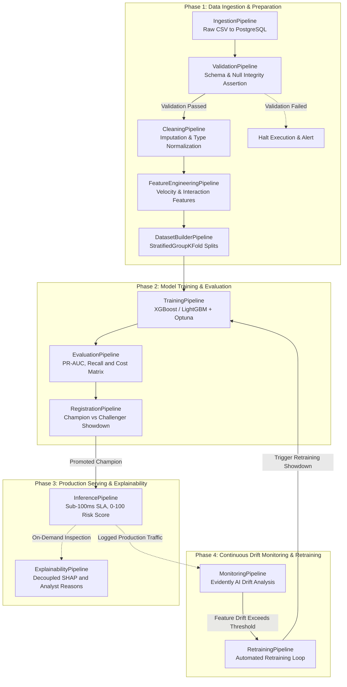
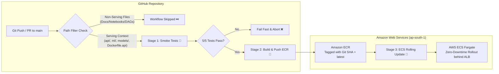

# Adaptive Financial Risk Intelligence Engine

[](https://www.python.org/)
[](https://fastapi.tiangolo.com/)
[](https://aws.amazon.com/fargate/)
[](https://aws.amazon.com/cloudfront/)
[](https://www.terraform.io/)
[](https://redis.io/)
[](https://mlflow.org/)
[](https://airflow.apache.org/)
[](https://www.docker.com/)
[](https://github.com/abhi24112/Financial_Risk_Intelligence_Engine_MLOps/actions)

---

## Executive Summary

The **Adaptive Financial Risk Intelligence Engine** is an enterprise-grade Machine Learning Operations (MLOps) system built for continuous financial transaction evaluation, risk scoring, and real-time fraud mitigation. 

Unlike conventional data science projects or exploratory notebooks, this system implements a production-grade cloud engineering architecture with a strict **sub-100ms prediction latency SLA**, decoupled explainability, automated champion/challenger model lifecycles, and drift-aware retraining workflows deployed on **AWS (ECS Fargate, ElastiCache Redis, RDS PostgreSQL, CloudFront)** via **Terraform (IaC)**.

### The Problem Formulation
* **Target Domain**: Credit card transaction evaluation on the IEEE-CIS Fraud Detection dataset (~590,000 transactions, 434 raw features).
* **Extreme Class Imbalance**: Genuine transactions heavily outnumber fraudulent events (~3.5% positive prevalence), necessitating cost-sensitive learning (`scale_pos_weight`) and evaluation prioritized around Precision-Recall AUC (PR-AUC) and Recall rather than deceptive accuracy metrics.
* **Production Constraint**: Synchronous fraud prevention requires instant scoring (<100ms), while forensic auditing requires detailed SHAP feature attributions that are computationally prohibitive to run on the hot path.

---

## AWS Cloud Production Architecture

The entire production stack is provisioned in the **AWS Mumbai (`ap-south-1`) region** across multiple Availability Zones using **Terraform**.



### Key Highlights of the AWS Architecture
1. **Zero Public Database Exposure:** RDS PostgreSQL and ElastiCache Redis have **zero public IP addresses**. They live strictly within private subnets, shielded by security groups allowing ingress only from the ECS Fargate tasks.
2. **Multi-AZ High Availability:** Subnets are partitioned across `ap-south-1a` and `ap-south-1b`. If an AWS data center suffers an outage, the ALB and database automatically route traffic to the healthy zone.
3. **Native S3 Concurrency Locking:** Remote Terraform state is secured in an encrypted S3 bucket (`abhishek-financial-risk-terraform-state-2026`) with `use_lockfile = true` (Terraform 1.10+ native conditional writes) to prevent concurrent state corruption without needing a separate DynamoDB table.
4. **Edge SSL via CloudFront:** CloudFront serves as an HTTPS reverse proxy with zero caching (`TTL = 0`), terminating SSL at edge locations worldwide and providing a valid Amazon-signed SSL padlock on any mobile carrier network (Jio, Airtel, etc.).

---

## Local System Architecture & Data Flow

For local development and continuous integration testing, the full multi-service stack runs via **Docker Compose**:



---

## Key MLOps Architectural Highlights

### 1. Champion/Challenger Model Registry (MLflow)
The system enforces a strict automated promotion gate. Candidate models (XGBoost, LightGBM) are trained using Bayesian hyperparameter optimization (Optuna) and registered as challengers. An automated evaluation gate compares the challenger against the current production champion on holdout test data; only models that demonstrate superior PR-AUC and recall are promoted to production status.

### 2. Ultra-Low Latency Serving (<100ms SLA)
The real-time inference layer is built using FastAPI with an asynchronous threadpool to keep the event loop non-blocking. Live inference bypasses slow relational database queries by reading customer velocity counters and transaction aggregations directly from an in-memory Redis Online Feature Store in O(1) time (<2ms lookup).

### 3. Decoupled Business Explainability (SHAP)
Prediction and explanation are architecturally decoupled to preserve the sub-100ms prediction SLA:
* **The `/predict` Endpoint**: Evaluates transactions instantly and returns the risk score, risk level, and calibrated probability.
* **The `/explain` Endpoint**: Runs asynchronously on a separate threadpool when requested by an analyst, computing SHAP `TreeExplainer` values and translating raw numeric attributions into domain-interpretable narratives (e.g., *"Transaction amount is 4.2x customer 90-day average"*).

### 4. Continuous Drift Monitoring & Automated Retraining (Evidently AI)
Data distribution shifts and concept drift are continuously tracked using Evidently AI inside a scheduled Airflow DAG. When feature drift or target drift exceeds configured statistical thresholds (e.g. >20% of features drifted), the DAG automatically branches to execute the `RetrainingPipeline` on dedicated batch compute resources.

### 5. Multi-Container Microservices Architecture
The local stack is coordinated across five Docker containers:
1. `risk_engine_postgres`: Relational transactional storage and persistent Apache Airflow metadata backend.
2. `risk_engine_redis`: Low-latency Online Feature Store and behavioral cache.
3. `risk_engine_mlflow`: Centralized experiment tracking server and Model Registry.
4. `risk_engine_api`: High-throughput FastAPI inference and explainability engine.
5. `risk_engine_airflow`: Workflow orchestrator running scheduled training and drift monitoring DAGs.

---

## Class-Based Pipeline Architecture

Following the system's modular design principles, every pipeline stage inherits from an abstract `BasePipeline` class (`pipelines/base_pipeline.py`). This guarantees uniform structured logging, timing telemetry, error propagation, artifact tracking, and configuration loading across all tasks.



### Core Pipeline Classes

| Pipeline File | Class Name | Output Artifact | Key Responsibility |
| :--- | :--- | :--- | :--- |
| `ingestion_pipeline.py` | `IngestionPipeline` | PostgreSQL raw tables | Ingests transactional and identity data into PostgreSQL. |
| `validation_pipeline.py` | `ValidationPipeline` | Validation report | Asserts schema integrity, data types, and primary key uniqueness. |
| `cleaning_pipeline.py` | `CleaningPipeline` | `cleaned.parquet` | Handles structural missingness, type downcasting, and sanitization. |
| `feature_engineering_pipeline.py` | `FeatureEngineeringPipeline` | `features.parquet` | Computes velocity metrics, interaction features, and aggregates. |
| `dataset_builder_pipeline.py` | `DatasetBuilderPipeline` | `train/val/test.parquet` | Implements leak-free `StratifiedGroupKFold` partitioning. |
| `training_pipeline.py` | `TrainingPipeline` | `model.pkl` | Trains gradient boosted trees and logs parameters/metrics to MLflow. |
| `evaluation_pipeline.py` | `EvaluationPipeline` | `evaluation.json` | Computes PR-AUC, ROC-AUC, F1, and cost-sensitive confusion matrices. |
| `registration_pipeline.py` | `RegistrationPipeline` | MLflow Production Model | Compares challenger vs. champion PR-AUC and promotes the winner. |
| `inference_pipeline.py` | `InferencePipeline` | Prediction dictionary | Combines raw payload with Redis cache to generate risk scores (0–100). |
| `explainability_pipeline.py` | `ExplainabilityPipeline` | SHAP explanations | Generates global and local feature attributions via `TreeExplainer`. |
| `monitoring_pipeline.py` | `MonitoringPipeline` | Drift reports (HTML/JSON) | Computes population stability index (PSI) and data drift via Evidently AI. |
| `retraining_pipeline.py` | `RetrainingPipeline` | Retrained model candidate | Executes end-to-end retraining when triggered by drift thresholds. |

---

## Technology Stack

| Layer | Technology | Purpose |
| :--- | :--- | :--- |
| **Modeling** | XGBoost, LightGBM, Scikit-learn | Gradient boosted decision trees for imbalanced tabular classification |
| **Hyperparameter Tuning** | Optuna | Bayesian hyperparameter optimization across cross-validation folds |
| **Explainability** | SHAP | Decoupled local feature contributions and human-readable narratives |
| **Experiment Tracking** | MLflow | Metric logging, parameter tracking, and Champion/Challenger Model Registry |
| **Workflow Orchestrator** | Apache Airflow 2.9 | Scheduled DAG execution (`LocalExecutor`, PostgreSQL metadata backend) |
| **Serving Layer** | FastAPI, Uvicorn | Asynchronous REST API serving `/predict`, `/predict/batch`, and `/explain` |
| **Online Feature Store** | Redis 7 / AWS ElastiCache | Sub-millisecond profile caching and transactional velocity tracking (<2ms) |
| **Relational Storage** | PostgreSQL 16 / AWS RDS | Transaction history and Airflow operational state store |
| **Data Drift Monitoring** | Evidently AI | Distribution drift detection, KS-tests, and data quality reporting |
| **Containerization** | Docker, Docker Compose | Multi-container local/production parity with health check orchestration |
| **CI/CD Automation** | GitHub Actions | Path-filtered smoke testing, ECR container packaging, and zero-downtime ECS rollout |
| **Cloud Infrastructure** | AWS (ECS Fargate, ALB, ECR) | Serverless container execution, load balancing, and private image registry |
| **Edge CDN & SSL** | AWS CloudFront | Edge caching, SSL termination, and global HTTPS routing |
| **Infrastructure as Code** | Terraform | Modular provisioning for all AWS resources with remote S3 state locking |

---

## Infrastructure as Code (Terraform) Architecture

All AWS infrastructure is managed using modular, production-ready Terraform under `infrastructure/terraform/`.

### 1. Terraform Directory Layout

```text
infrastructure/terraform/
├── bootstrap/                    # Remote State & Concurrency Lockfile Setup
│   ├── main.tf                   # S3 state bucket with AES256 encryption & versioning
│   ├── variables.tf
│   └── outputs.tf
├── environments/
│   └── dev/                      # Root Dev Environment Orchestrator
│       ├── backend.tf            # S3 Backend + use_lockfile = true
│       ├── providers.tf          # AWS Provider (~> 6.0)
│       ├── variables.tf
│       ├── locals.tf
│       ├── main.tf               # Orchestrates all child modules
│       ├── outputs.tf            # Exposes CloudFront URL, ALB DNS, DB & Redis endpoints
│       └── terraform.tfvars.example
└── modules/
    ├── networking/               # Multi-AZ VPC (ap-south-1a & 1b), 2x Public, 2x Private, IGW, NAT
    ├── security/                 # Security Groups with ingress + explicit egress rules
    ├── iam/                      # ECS Task Execution Role & ECS Task Role
    ├── database/                 # RDS PostgreSQL 16 + DB Subnet Group + Secrets Manager
    ├── cache/                    # ElastiCache Redis 7 + Subnet Group
    ├── load_balancer/            # ALB + Target Group (/health) + Port 80 Listener
    ├── compute/                  # ECR + CloudWatch + ECS Cluster + Fargate Task & Service
    └── cdn/                      # CloudFront HTTPS CDN distribution (free SSL proxy)
```

### 2. Core Architectural & Systems Engineering Math

#### CIDR Subnetting Math & The AWS 5-IP Rule
An IPv4 address has 32 bits. Total addresses in a subnet prefix $N$ is calculated as:
$$\text{Total IPs} = 2^{(32 - N)}$$
* **VPC CIDR (`10.0.0.0/16`):** $2^{(32 - 16)} = 2^{16} = 65,536$ total IP addresses.
* **Subnets (`/24`):** $2^{(32 - 24)} = 2^8 = 256$ total addresses.
* **AWS 5-IP Reservation Rule:** In every AWS subnet, AWS reserves 5 IP addresses (`.0` network, `.1` router, `.2` DNS, `.3` future, `.255` broadcast).
$$\text{Usable Host IPs per Subnet} = 256 - 5 = \mathbf{251\text{ usable IPs}}$$
* **Allocated Blocks:**
  * Public: `10.0.1.0/24` (AZ-a) and `10.0.2.0/24` (AZ-b)
  * Private: `10.0.11.0/24` (AZ-a) and `10.0.12.0/24` (AZ-b)
  * Unassigned buffer (`10.0.3.0` – `10.0.10.0`) allows future expansion without CIDR overlap conflicts.

#### Multi-AZ Quorum Requirement
AWS Application Load Balancers, RDS Subnet Groups, and ElastiCache Subnet Groups **strictly require at least two subnets across two distinct Availability Zones**. Single-AZ setups are rejected by the AWS API and represent a single point of failure.

#### State Locking Math & Concurrency (`use_lockfile = true`)
In Terraform 1.10+, `use_lockfile = true` uses **Amazon S3 native conditional writes** (`PutObject` with HTTP `If-None-Match`). If two engineers run `terraform apply` concurrently, S3 rejects the second write with an `HTTP 412 (Precondition Failed)` error, preventing race conditions without needing a separate DynamoDB table.

#### Fargate Sizing & Latency Budget Math (<100ms SLA)
* Hardware allocation: `512` CPU units (0.5 vCPU) and `1024` MiB RAM (1 GB).
* **Latency Budget Breakdown:**
  $$\text{Total P95 Latency} = T_{\text{ALB}} + T_{\text{Redis}} + T_{\text{Model}} + T_{\text{JSON}} \approx 3\text{ms} + 2\text{ms} + 18\text{ms} + 2\text{ms} = \mathbf{\sim 25\text{ms}}$$
  Collocating Fargate tasks and ElastiCache Redis in the same VPC private subnets keeps feature lookup latency sub-2ms, easily beating the <100ms SLA.

---

### 3. Deploying to AWS via Terraform

#### Step 1: Bootstrap Remote State (Run Once)
```powershell
terraform -chdir=infrastructure/terraform/bootstrap init
terraform -chdir=infrastructure/terraform/bootstrap apply -auto-approve
```

#### Step 2: Create the Private ECR Container Registry
```powershell
terraform -chdir=infrastructure/terraform/environments/dev init
terraform -chdir=infrastructure/terraform/environments/dev apply -target=module.compute.aws_ecr_repository.api -auto-approve
```

#### Step 3: Build & Push the Docker Image to ECR
```powershell
# 1. Authenticate Docker with your AWS ECR
aws ecr get-login-password --region ap-south-1 --profile terraform-lab | docker login --username AWS --password-stdin 205096517604.dkr.ecr.ap-south-1.amazonaws.com

# 2. Build the image locally
docker build -t financial-risk-engine-dev-api:latest -f docker/Dockerfile.api .

# 3. Tag and push to ECR
docker tag financial-risk-engine-dev-api:latest 205096517604.dkr.ecr.ap-south-1.amazonaws.com/financial-risk-engine-dev-api:latest
docker push 205096517604.dkr.ecr.ap-south-1.amazonaws.com/financial-risk-engine-dev-api:latest
```

#### Step 4: Provision Full Cloud Infrastructure
```powershell
terraform -chdir=infrastructure/terraform/environments/dev apply
```

#### Step 5: Clean Teardown (Avoid Unwanted Cloud Costs)
```powershell
terraform -chdir=infrastructure/terraform/environments/dev destroy
```

---

## Continuous Integration & Continuous Deployment (CI/CD)

The serving container lifecycle is automated using **GitHub Actions**, providing continuous validation, Docker container packaging, Amazon ECR versioning, and zero-downtime rolling updates on AWS ECS (Fargate).



### Key Highlights of the CI/CD Pipeline
1. **Intelligent Path Filtering (`paths:`)**: The pipeline rebuilds the container **only** when files packaged into the serving container change (`api/**`, `ml/**`, `models/**`, `shared/**`, `configs/**`, `requirements.txt`, `docker/Dockerfile.api`, `main.py`). Commits touching documentation, exploratory notebooks, or Airflow DAGs skip container builds to conserve runner and cloud minutes.
2. **Fail-Fast Smoke Testing**: Executes an automated 5-second test suite (`tests/unit/test_ci_smoke.py`) on Ubuntu with Python 3.12, verifying configuration integrity (`api.yaml`, `model.yaml`), Pydantic schema validation (`TransactionRequest`, `BatchTransactionRequest`), and FastAPI application boot with `/health` liveness checks before running multi-layer Docker builds.
3. **Automated Docker Packaging & Multi-Tagging**: Builds `docker/Dockerfile.api` with the pre-baked champion model (`models/production_model.skops`, 3.2 MB) and pushes two distinct tags to Amazon ECR:
   - **Immutable Git Commit SHA** (`${{ github.sha }}`) for deterministic tracking and instant rollbacks.
   - **`latest`** tag for standard continuous deployment.
4. **Resilient Zero-Downtime ECS Rolling Update**: Verifies cluster and service status before triggering `aws ecs update-service --force-new-deployment`. New Fargate tasks are launched, pass ALB health checks, and traffic shifts smoothly without service interruption. If the ECS service is temporarily stopped to save costs, the workflow notes the ECR push and completes cleanly without failing.

> For complete documentation, secret configuration tables, and interview questions, see [`Doc/cicd_docs/ci_cd_pipeline.md`](Doc/cicd_docs/ci_cd_pipeline.md).

---

## Repository Structure

```text
Adaptive-Financial-Risk-Intelligence-Engine/
├── .github/                    # GitHub Actions CI/CD workflows
│   └── workflows/
│       └── ci_cd.yml           # Automated smoke test, ECR build/push & ECS rolling deploy
├── airflow/                    # Apache Airflow DAGs and orchestration configuration
│   └── dags/
│       ├── financial_risk_training_dag.py     # End-to-end training & registration DAG
│       └── financial_risk_monitoring_dag.py   # Continuous drift monitoring & retraining DAG
├── api/                        # Production FastAPI application
│   ├── routes/                 # Endpoint modules: /predict, /explain, /health, /ui
│   ├── schemas.py              # Pydantic request/response validation contracts
│   └── app.py                  # Application factory with lifespan and dependency injection
├── configs/                    # Centralized YAML configuration files
│   ├── airflow.yaml            # DAG schedules, retry policies, and task arguments
│   ├── database.yaml           # PostgreSQL connection pools and table names
│   ├── model.yaml              # Hyperparameters, feature triage lists, and thresholds
│   └── monitoring.yaml         # Drift detection thresholds and Evidently test suites
├── database/                   # Database interfaces, connection pools, and loaders
├── docker/                     # Service-specific Dockerfiles (API, Airflow, MLflow)
├── Doc/                        # Architectural blueprints and interview guides
│   └── Interview_Questions/    # Comprehensive 90-question interview bank with spoken scripts
├── explainability/             # SHAP calculation engines and reason mapping utilities
├── feature_store/              # Redis feature store clients and customer profile builders
├── infrastructure/             # Production Terraform Infrastructure as Code
│   └── terraform/
│       ├── bootstrap/          # S3 remote state bucket provisioning
│       ├── environments/dev/   # Dev environment root module
│       └── modules/            # Networking, security, iam, database, cache, compute, cdn
├── ml/                         # Core machine learning logic (training, evaluation, tuning)
├── models/                     # Production champion and challenger models (.skops, .dvc)
├── pipelines/                  # Class-based pipeline stages (BasePipeline implementations)
├── scripts/                    # Command-line entry points for training, tuning, and testing
├── shared/                     # Cross-cutting utilities: structured logging, exceptions, config loaders
├── tests/                      # Unit, integration, and API test suites
└── docker-compose.yml          # Multi-service container orchestration manifest
```

---

## Getting Started (Local Development)

### 1. Environment Setup
Clone the repository and activate the dedicated Conda environment:

```bash
git clone https://github.com/abhi24112/Financial_Risk_Intelligence_Engine_MLOps.git
cd Financial_Risk_Intelligence_Engine_MLOps

# Activate conda environment
conda activate financial_risk_intelligence
```

### 2. Start the Multi-Container Local Stack
Launch all five microservices in detached mode:

```bash
docker compose up -d
```

Verify that all containers reach a healthy state:

```bash
docker compose ps
```

### 3. Local Endpoints and Dashboards
Once running, the following interfaces are available:

* **FastAPI Swagger Documentation**: [http://localhost:8000/docs](http://localhost:8000/docs)
* **FastAPI Interactive UI**: [http://localhost:8000/ui](http://localhost:8000/ui)
* **MLflow Tracking Server & Model Registry**: [http://localhost:5000](http://localhost:5000)
* **Apache Airflow Webserver**: [http://localhost:8080](http://localhost:8080)
  * **Username**: `admin`
  * **Password**: `admin`

### 4. Running Pipelines via CLI
Core ML workflows can be executed directly using the standalone CLI scripts:

```bash
# Set PYTHONPATH for module resolution
$env:PYTHONPATH = "."          # Windows PowerShell
# export PYTHONPATH="."        # Linux / macOS

# 1. Run Bayesian hyperparameter tuning with Optuna
python scripts/tune.py --model lightgbm

# 2. Train the model and log artifacts to MLflow
python scripts/train.py --config model.yaml

# 3. Evaluate and promote candidate model via Champion/Challenger showdown
python scripts/register.py --config model.yaml
```

### 5. Triggering DAGs via Apache Airflow CLI
Pipelines can also be orchestrated within the containerized Airflow environment:

```bash
# Trigger the complete training, evaluation, and registration pipeline
docker compose exec airflow airflow dags trigger financial_risk_training_pipeline

# Trigger the continuous drift monitoring pipeline
docker compose exec airflow airflow dags trigger financial_risk_drift_monitoring

# List all registered DAGs
docker compose exec airflow airflow dags list
```

### 6. Executing Test Suites
Run the automated test suite across unit and integration tests:

```bash
pytest tests/unit tests/integration -v
```
